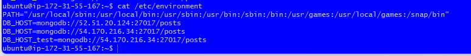

## Install Ansibile

1. Create instance with AMI = 20.04 lts
2. Connect via SSH to Gitbash terminal
3. Run commands: 
```
sudo apt update
```
```
sudo apt upgrade -y
```
4. Installs the `software-properties-common` package, which provides scripts for managing software repositories. This is a prerequisite for adding the Ansible repository:
```
sudo apt install software-properties-common
```
6. Adds the Ansible Personal Package Archive (PPA) to your list of sources. This ensures that you can install Ansible directly from this source:
```commandline
*`sudo apt-add-repository ppa:ansible/ansible`*: 
```
7. *`sudo apt update -y`*: Updates the local package cache to make sure you have the latest list of packages from all repositories, including the recently added Ansible PPA.
8. *`sudo apt install ansible -y`*: Installs the Ansible software package.
9. *`ansible --version`*: Checks the installed version of Ansible.

### Inside Ansible
1. *`cd /etc/ansible/`*: Navigates to the `/etc/ansible/` directory, where Ansible's global configuration and inventory files are typically located.
2. *`sudo apt install tree`*: Installs the `tree` utility, which is used for directory visualization.
3. *`tree`*: Runs the `tree` command to display a tree view of the directory structure. In this case, you would be seeing the structure of the `/etc/ansible/` directory.

#### SSH
1. Open a new second Gitbash terminal
1. Make sure your in the home directory `cd`
2. Run command *`scp -i "/.ssh/tech254.pem" ~/.ssh/tech254.pem ubuntu@ec2-34-250-136-251.eu-west-1.compute.amazonaws.com:/.ssh`*: Copies your local `.pem` file (`tech254.pem`) to a remote machine via SSH. The `-i` option specifies the key to use for the operation.
**NOTE: change IP address for your instance**
   - Source: `~/.ssh/tech254.pem`
   - Destination: `ubuntu@ec2-34-250-136-251.eu-west-1.compute.amazonaws.com:~/.ssh`
   
4. *`cd .ssh` back to ssh folder 
5. ls to check if it's `tech254.pem`

#### Connecting to different instance
1. Inside first terminal, Run command `nano inventory.ini`
2. Copy and paste:
```
# inventory.ini
[my_instance]
34.245.20.82 ansible_ssh_private_key_file=~/.ssh/tech254.pem ansible_ssh_user=ubuntu
```
NOTE: IP ADDRESS IS DEPENDANT ON WHICH instance you want to connect.

3. Run:
```
chmod 400 ~/.ssh/tech254.pem
```

4. Run inventory
```
ansible -i inventory.ini my_instance -m ping
```

5. Create playbook test
```
nano my_playbook.yml
```

3. Copy and paste:
```
---
- name: My Ansible Playbook
  hosts: my_instance
  tasks:
    - name: Echo a message
      command: echo "Hello, Ansible!"
```
`ansible-playbook -i inventory.ini my_playbook.yml`s

### Check that the connection is connected properly and working (ping)
1. `cd /etc/ansible/`
2. sudo nano hosts
3. Copy and paste this:
```
[web]

ec2-instance ansible_host=3.252.98.110 ansible_user=ubuntu ansible_ssh_private_key_file=/home/ubuntu/.ssh/tech2>
# sudo chmod 400 tech254.pem

[db]

ec2-instance ansible_host=54.170.216.34 ansible_user=ubuntu ansible_ssh_private_key_file=/home/ubuntu/.ssh/tech>
```

## Installing nginx and nodelJS in Ansible

1. Run command
```
sudo ansible web -m ping
```

2. Go into host file using command
```
sudo nano hosts
```

3. Create new script to install ngin: `sudo nano install-nginx.yml`

4. Copy and paste

``` 
create a playbook to provision ngin web server in web-node
---
#starts with thee dashes
# where do you want to install or run this playbook
- hosts: web

# find the facts
  gather_facts: yes

# provide admin access to this playbook
  become: true

# provide the actual instructions - instal nginx
  tasks:
  - name: provision/install/configure Nginx
    apt: pkg=nginx state=present

# ensure nginx is running/enabled
```

5. Run the script: `sudo ansible-playbook install-nginx.yml`

6. Create new script to install nodeJS: `sudo nano install-nodejs.yml`

7. Copy and paste commands:
```
---
# where do you want to install or run this playbook
- hosts: web

# find the facts
  gather_facts: yes

# provide admin access to this playbook - use sudo
  become: true

# provide the actual instructions - install NodeJS
  tasks:
  - name: Install the NodeSource Node.js 12.x release PPA
    shell: "curl -sL https://deb.nodesource.com/setup_12.x | bash -"

  - name: Install Node.js
    apt: pkg=nodejs state=present

  - name: Check Node.js version
    shell: "node -v"
    register: node_version

  - name: Display Node.js version
    debug:
      msg: "Node.js version is {{ node_version.stdout }}"

  - name: Check NPM version
    shell: "npm -v"
    register: npm_version

  - name: Display NPM version
    debug:
      msg: "NPM version is {{ npm_version.stdout }}"
```

Run the script: `sudo ansible-playbook install-nodejs.yml`

Should out the below:


## Installing MongoDB  

1. `sudo nano mongo-playbook.yml` 
2. Copy and paste command
```commandline
#this playbook is to set up mongodb in the db ec2

---

#agent node name/ip
- hosts: db

#gather facts
  gather_facts: yes
#provide admin access
  become: true
#provide instructions
  tasks:
  - name: set up mongodb in instance
    #shell:
    apt: pkg=mongodb state=present
#ensure db is running

```
Run the script: `sudo ansible-playbook mongo-playbook.yml`

### Checking the mongodb is working
Run command:

```commandline
sudo ansible db -a "sudo systemctl status mongodb"
```
NOTE: You can check the app or db when it is running using this command 

## Creating Playbook to configure the bind IP
1. create new playbook
```commandline
sudo nano mongodb-config.yml
```
2. Copy and paste the commands:
```commandline
#this playbook is to confifure bind ip
---

- name: Configure MongoDB to Accept Requests
  hosts: db
  become: yes
  tasks:
    - name: Set bind IP to accept requests from all IPs
      lineinfile:
        path: /etc/mongodb.conf
        regexp: '^bindIp:'
        line: 'bindIp: 0.0.0.0'

```
3. Save and run to see if it works:
```commandline
sudo ansible-playbook mongodb-config.yml
```


## Restart and enable the db after change


1. go back into the mongodb-config.yml:
2. Add the last bits to restart and enable
```commandline
---
- name: Configure MongoDB to Accept Requests
  hosts: db
  become: yes
  tasks:
    - name: Set bind IP to accept requests from all IPs
      lineinfile:
        path: /etc/mongodb.conf
        regexp: '^bindIp:'
        line: 'bindIp: 0.0.0.0'

    - name: Restart MongoDB Service
      service:
        name: mongodb
        state: restarted

    - name: Enable MongoDB Service on Boot
      service:
        name: mongodb
        enabled: yes
```
## Creating deploy-app file
1. `sudo nano deploy-app.yml`
2. Copy and paste:
```commandline

# This playbook is to set the DB_HOST env var in the app instance.

---

- hosts: web
  gather_facts: yes
  become: true

  tasks:

    - name: exports the DB_HOST environment variable.
      become: true
      lineinfile:
        path: /etc/environment
        line: 'DB_HOST=mongodb://54.170.216.34:27017/posts'
        state: present
      notify: Reload environment

  handlers:
    - name: Reload environment
      become: true
      command: 'source /etc/environment'

```
3. Run `sudo ansible-playbook deploy-app.yml`

## Create env var with DB IP
1. Run command:
```
sudo ansible web -m shell -a"sudo chmod 644 /etc/environment"  
```
2. The run the deploy-app file
```
sudo ansible-playbook deploy-app.yml
```
3. To check this has worked now, go into the **app** Gitbash terminal and run command:
```
cat /etc/environment
```
We should expect the DB_HOST to be there as shown below:


## Relaunching the App

